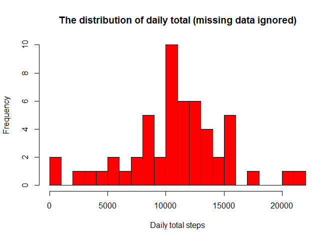

Reproducible Research Week 2 - Project 1
================
Ravi C
December 4, 2017

1.Code for reading in the dataset and/or processing the data
------------------------------------------------------------

assuming the data is downloaded in the working directory

``` r
activitydf <- read.csv("activity.csv", head=TRUE, na.strings="NA")
head(activitydf)
```

    ##   steps       date interval
    ## 1    NA 2012-10-01        0
    ## 2    NA 2012-10-01        5
    ## 3    NA 2012-10-01       10
    ## 4    NA 2012-10-01       15
    ## 5    NA 2012-10-01       20
    ## 6    NA 2012-10-01       25

``` r
str(activitydf)
```

    ## 'data.frame':    17568 obs. of  3 variables:
    ##  $ steps   : int  NA NA NA NA NA NA NA NA NA NA ...
    ##  $ date    : Factor w/ 61 levels "2012-10-01","2012-10-02",..: 1 1 1 1 1 1 1 1 1 1 ...
    ##  $ interval: int  0 5 10 15 20 25 30 35 40 45 ...

Change the data type of date which is listed as vector also remove the na's from the data set

``` r
activitydf$date = as.Date(activitydf$date)
subsetactivitydf = subset(activitydf, !is.na(activitydf$steps))
str(subsetactivitydf)
```

    ## 'data.frame':    15264 obs. of  3 variables:
    ##  $ steps   : int  0 0 0 0 0 0 0 0 0 0 ...
    ##  $ date    : Date, format: "2012-10-02" "2012-10-02" ...
    ##  $ interval: int  0 5 10 15 20 25 30 35 40 45 ...

2.Histogram of the total number of steps taken each day
-------------------------------------------------------

``` r
everydaytotal <- tapply(subsetactivitydf$steps, subsetactivitydf$date, sum, na.rm=TRUE, simplify=T)
everydaytotal <- everydaytotal[!is.na(everydaytotal)]

hist(x=everydaytotal,
     col="red",
     breaks=20,
     xlab="Daily total steps",
     ylab="Frequency",
     main="The distribution of daily total (missing data ignored)")
```



``` r
dev.copy(png, file="DailyTotalStepsHist.png", height=480, width=480) 
```

    ## png 
    ##   3

``` r
dev.off() 
```

    ## png 
    ##   2

3.Mean and median number of steps taken each day
------------------------------------------------

``` r
mean(everydaytotal)
```

    ## [1] 10766.19

``` r
median(everydaytotal)
```

    ## [1] 10765

4.Time series plot of the average number of steps taken
-------------------------------------------------------

``` r
everydayaverage <- tapply(subsetactivitydf$steps, subsetactivitydf$interval, mean, na.rm=TRUE, simplify=T)
dataframe_everydayaverage <- data.frame(interval=as.integer(names(everydayaverage)), avg=everydayaverage)
with(dataframe_everydayaverage,
     plot(interval,
          avg,
          type="l",
          xlab="5-minute intervals",
          ylab="average steps in the interval across all days"))
```


``` r
dev.copy(png, file="everdayaverage.png", height=480, width=480) 
```

    ## png 
    ##   3

``` r
dev.off() 
```

    ## png 
    ##   2

5. which 5-minute interval, on average across all the days in the dataset, contains the maximum number of steps?
----------------------------------------------------------------------------------------------------------------

``` r
max_steps <- max(dataframe_everydayaverage$avg)
dataframe_everydayaverage[dataframe_everydayaverage$avg == max_steps, ]
```

    ##     interval      avg
    ## 835      835 206.1698

6.Code to describe and show a strategy for imputing missing data
----------------------------------------------------------------

### Calculate and report the total number of missing values in the dataset (i.e. the total number of rows with NAs)

``` r
sum(is.na(activitydf$steps))
```

    ## [1] 2304

### Devise a strategy for filling in all of the missing values in the dataset. The strategy does not need to be sophisticated. For example, you could use the mean/median for that day, or the mean for that 5-minute interval, etc.

``` r
activitydf_impute <- activitydf
naSteps <- is.na(activitydf_impute$steps)
everydayaverage <- tapply(subsetactivitydf$steps, subsetactivitydf$interval, mean, na.rm=TRUE, simplify=T)
activitydf_impute$steps[naSteps] <- everydayaverage[as.character(activitydf_impute$interval[naSteps])]
```

### Create a new dataset that is equal to the original dataset but with the missing data filled in

``` r
new_everydaytotal <- tapply(activitydf_impute$steps, activitydf_impute$date, sum, na.rm=TRUE, simplify=T)
```

7.Histogram of the total number of steps taken each day after missing values are imputed
----------------------------------------------------------------------------------------

### Make a histogram of the total number of steps taken each day and Calculate and report the mean and median total number of steps taken per day. Do these values differ from the estimates from the first part of the assignment? What is the impact of imputing missing data on the estimates of the total daily number of steps?

``` r
hist(x=new_everydaytotal,
     col="red",
     breaks=20,
     xlab="daily steps",
     ylab="frequency",
     main="The distribution of daily total (with missing data imputed)")
```


``` r
dev.copy(png, file="dailytotalimputedHist.png", height=480, width=480) 
```

    ## png 
    ##   3

``` r
dev.off()
```

    ## png 
    ##   2

``` r
mean(new_everydaytotal)
```

    ## [1] 10766.19

``` r
median(new_everydaytotal)
```

    ## [1] 10766.19

8.Panel plot comparing the average number of steps taken per 5-minute interval across weekdays and weekends
-----------------------------------------------------------------------------------------------------------

``` r
# helper function to decide if a day is a week day or not
is_weekday <- function(d) {
    wd <- weekdays(d)
    ifelse (wd == "Saturday" | wd == "Sunday", "weekend", "weekday")
}

wx <- sapply(activitydf_impute$date, is_weekday)
activitydf_impute$wk <- as.factor(wx)
head(activitydf_impute)
```

    ##       steps       date interval      wk
    ## 1 1.7169811 2012-10-01        0 weekday
    ## 2 0.3396226 2012-10-01        5 weekday
    ## 3 0.1320755 2012-10-01       10 weekday
    ## 4 0.1509434 2012-10-01       15 weekday
    ## 5 0.0754717 2012-10-01       20 weekday
    ## 6 2.0943396 2012-10-01       25 weekday

9.All of the R code needed to reproduce the results (numbers, plots, etc.) in the report
----------------------------------------------------------------------------------------

``` r
wk_df <- aggregate(steps ~ wk+interval, data=activitydf_impute, FUN=mean)

library(lattice)
xyplot(steps ~ interval | factor(wk),
       layout = c(1, 2),
       xlab="Interval",
       ylab="Number of steps",
       type="l",
       lty=1,
       data=wk_df)
```


``` r
#dev.copy(png, file="xyplot.png", height=480, width=480) 
#dev.off()
```

From the panel plot it looks like the weekday activities arise earlier than the weekends - weekday activities arise around 5~6am and weekend activities arise around 8am. We can also observe that from 10am to 5pm, the weekends have higher activity levels than the weekdays.
